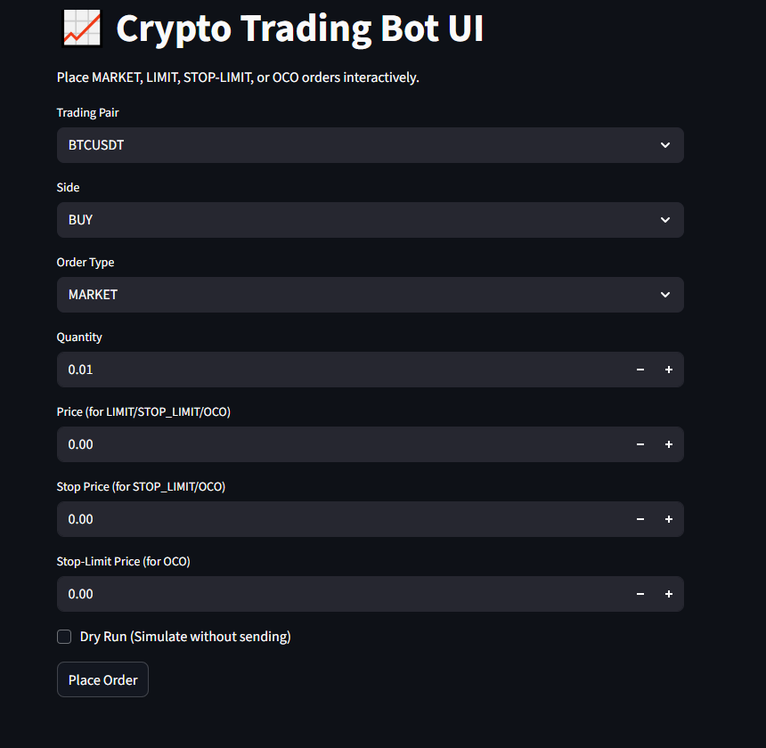
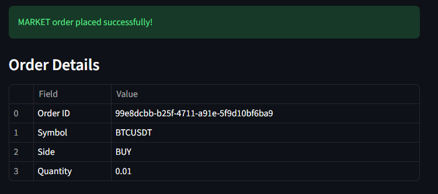
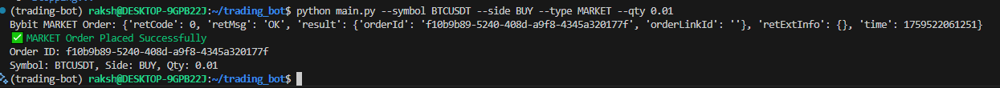

# Crypto Trading Bot

A Python-based crypto trading bot supporting **Binance Futures Testnet (USDT-M)** and **Bybit Testnet**.  
Place **MARKET, LIMIT, STOP-LIMIT, and OCO orders** via **CLI or Streamlit UI**, with logging, error handling, and dry-run mode for testing.

---

## Features

- ✅ Place **MARKET** and **LIMIT** orders  
- ✅ Place **STOP-LIMIT** and **OCO** orders  
- ✅ Support for **BUY** and **SELL** sides  
- ✅ **Command-Line Interface (CLI)** for fast execution  
- ✅ **Streamlit UI** for interactive order placement  
- ✅ **Dry Run Mode**: simulate orders without sending to the exchange  
- ✅ Logs all orders and errors  
- ✅ Works with both **Binance** and **Bybit** testnets  

---

## Requirements

- Python 3.10+  
- pip packages:

```bash
pip install python-binance bybit streamlit colorama

```
### Supported Exchanges

This bot supports both **Binance Futures Testnet** and **Bybit Testnet**.  

You can switch the exchange by updating the `EXCHANGE` variable in `config.py`:

```python
EXCHANGE = "binance"  # or "bybit"

## File Structure

trading-bot/
│
├─ main.py             # Entry point: CLI or UI
├─ cli.py              # CLI implementation (optional)
├─ exchange_binance.py # Binance testnet order functions
├─ exchange_bybit.py   # Bybit testnet order functions
├─ ui.py               # Streamlit UI
├─ config.py           # API keys and exchange selection
├─ logger.py           # Logging functions
└─ utils.py            # Utility functions (e.g., logging)


## CLI Usage
## MARKET Order

```bash
python main.py --symbol BTCUSDT --side BUY --type MARKET --qty 0.01
```
## Output Example
```yaml
✅ MARKET Order Placed Successfully
Order ID: abc123
Symbol: BTCUSDT, Side: BUY, Qty: 0.01
```

## LIMIT Order
```bash
python main.py --symbol BTCUSDT --side SELL --type LIMIT --qty 0.01 --price 32000
```


## Output Example
```bash
✅ LIMIT Order Placed Successfully
Order ID: def456
Symbol: BTCUSDT, Side: SELL, Qty: 0.01
```

## STOP-LIMIT Order
```bash
python main.py --symbol BTCUSDT --side BUY --type STOP_LIMIT --qty 0.01 --price 31550 --stop_price 31500
```

## Possible Output
```bash
❌ Order could not be processed
Error from exchange: triggerPrice must be > lastPrice
```
## OCO Order
```bash
python main.py --symbol BTCUSDT --side SELL --type OCO --qty 0.01 --price 32000 --stop_price 29000 --stop_limit_price 28500
```

## Output Example
```bash
✅ OCO Order Placed Successfully
  LIMIT Order ID: ghi789
  STOP-LIMIT Order ID: jkl012
```

## Dry Run Mode
```bash
python main.py --symbol BTCUSDT --side BUY --type MARKET --qty 0.01 --dry_run
```

## Output Example
```bash
Dry Run: Order not sent
{'symbol': 'BTCUSDT', 'side': 'BUY', 'type': 'MARKET', 'qty': 0.01}
```
## Streamlit UI
```bash
Run:

streamlit run ui.py
```

## UI Features

-Dropdown for available symbols

-Side selection: BUY / SELL

-Order type selection: MARKET, LIMIT, STOP-LIMIT, OCO

-Input fields for quantity, price, stop price, stop-limit price

-Dry Run option

-Displays success or error messages clearly



### placing order


### cli output


### Notes

- STOP-LIMIT orders may fail on testnet if triggerPrice is invalid relative to the current market price. This is expected behavior from the exchange, not a bot issue.

- OCO orders are simulated with two linked orders. On testnet, one leg may need manual monitoring since auto-cancellation is not enforced.

## Author

Rakshit Gupta

Email: rakshitgupta749@gmail.com

GitHub: [https://github.com/your-username](https://github.com/Mr-RAKSHIT-2004-GUPTA)
